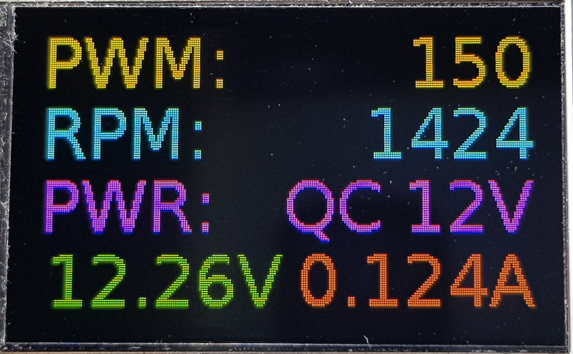

PWM Fan Controller
==================

PWM Fan Controller based on ESP32 chip.

## Main Features

* EC11 encoder input
* INA219 power monitor
* ST7789 135x240 LCD panel
* Quick Charge 2.0 support
* Fan RPM calculation
* BLE control interface (OTA firmware update / fan remote control)

## UI



## Preparing

### Obtain the source

```
git clone --recursive https://github.com/redchenjs/pwm_fan_controller_esp32.git
```

### Update an existing repository

```
git pull
git submodule update --init --recursive
```

### Setup the tools

```
./esp-idf/install.sh
```

## Building

### Setup the environment variables

```
export IDF_PATH=$PWD/esp-idf
source ./esp-idf/export.sh
```

### Configure

```
idf.py menuconfig
```

* All project configurations are under the `PWM Fan Controller` menu.

### Flash & Monitor

```
idf.py flash monitor
```
